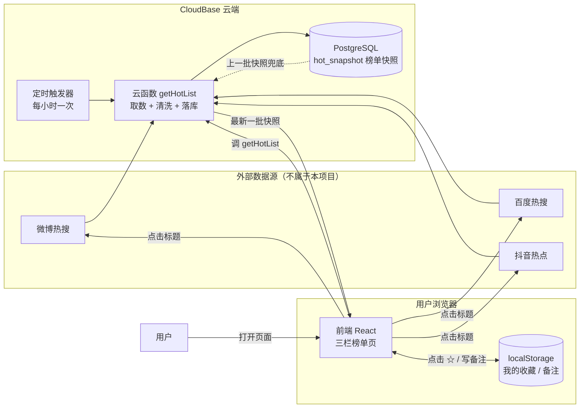

# TECH_DESIGN.md —「今日热搜」技术设计

> 日期：2026-09-19（Day 5）｜版本：v1.0｜上游文档：PRD.md（Day 4）  
> 本文档回答"数据从哪来、到哪去，用什么技术实现"。**不包含任何代码**，代码在 Day 7 MVP 阶段写。  
> 本文同时解决 PRD 留下的两个钩子：更新频率（第 1 节末）与卡顿量化标准（第 6 节末）。

## 1. 技术路线比较与选择

### 1.1 三套候选方案

| 维度    | A 纯前端                                     | B 前端 + 云函数（无数据库）        | **C 示范路线（选定）**                                                        |
| ----- | ----------------------------------------- | ----------------------- | --------------------------------------------------------------------- |
| 组成    | 只有网页，浏览器直接调第三方数据接口                        | 网页 + 一个云函数替前端取数并缓存      | React/Vite 网页 + CloudBase Node.js 云函数 + CloudBase PostgreSQL + 静态网站托管 |
| 一句话理解 | 大堂自己去菜市场买菜                                | 大堂配了个采购员，不让客人跑市场        | 大堂、后厨、仓库全配齐                                                           |
| 学习成本  | 最低                                        | 中                       | 最高（要认识云函数、数据库、环境变量）                                                   |
| 线上持久化 | 无（数据只活在浏览器内存）                             | 无（缓存一重启就没了）             | **有**（榜单快照落库，可回溯）                                                     |
| 费用    | 0                                         | 0（CloudBase 免费额度内）      | 免费额度内 0，超出后才按量计费                                                      |
| 排错难度  | 看着简单，实际最难：浏览器直连第三方接口会被跨域（CORS）拦死，报错信息还不明确 | 中：多一层云函数，但能在云端日志里看到完整报错 | 中偏高：要看云函数日志 + SQL，但资料最全                                               |

### 1.2 为什么选 C（必须写清的理由）

1. **和课程后续对齐**：第 23 天会用到环境变量和数据库配置，路线 C 就是照那条线设计的；今天在范例上见过一遍，将来给自己的项目（奇思妙想百科）立项时，仓库和后厨怎么搭心里有数。
2. **能兜住 PRD 的异常要求**：榜单快照落库后，某平台接口临时挂了可以拿上一批快照顶着，页面不会开天窗——这正好满足 PRD 第 7 节"单个平台失败不影响其他两栏"。
3. **给未来留门**：收藏现在是浏览器本地的（PRD 定的），但一旦想"换设备不丢收藏"，就必须有真数据库。今天把仓库建好，那天只要加张表。

### 1.3 技术栈

| 层    | 选型                    | 职责                                |
| ---- | --------------------- | --------------------------------- |
| 前端   | React 18 + Vite       | 渲染三栏榜单、处理收藏交互、做响应式布局              |
| 后端   | CloudBase Node.js 云函数 | 定时去三个平台取数、清洗成统一结构、写库、给前端提供查询接口    |
| 数据库  | CloudBase PostgreSQL  | 存榜单快照（**不存用户收藏**，收藏按 PRD 留在浏览器本地） |
| 部署   | CloudBase 静态网站托管      | 托管前端构建产物，给出一个能分享的网址               |
| 版本管理 | Git + GitHub（已有）      | 代码与文档的历史存档                        |

### 1.4 更新频率（PRD 遗留钩子，此处定稿）

**决定：小时级。** 云函数挂一个**每小时跑一次的定时触发器**，一次抓三个平台，整批写入数据库。

- 理由：热搜是"小时级话题"，做到分钟级需要持续高频请求，容易被数据源限流，也和"简约轻量"的定位不符。
- 页面表现：顶部显示"数据更新于 X 分钟前"，用户能自己判断新旧。

## 2. 项目结构

```
daka/
├── AGENTS.md              项目规则（Day 1）
├── research.md            需求研究（Day 3）
├── PRD.md                 产品需求（Day 4）
├── TECH_DESIGN.md         技术设计（Day 5，本文件）
├── index.html             Day 2 的占位首页（Day 7 后处理，见第 9 节 Q3）
├── .gitignore             忽略规则（Day 2，已覆盖 .env）
│
├── frontend/              前端（React + Vite）
│   ├── index.html
│   ├── package.json
│   ├── vite.config.js     含开发期把 /api 转发到云函数的配置
│   └── src/
│       ├── main.jsx
│       ├── App.jsx                     总布局：三栏并排 / 手机堆叠
│       ├── components/
│       │   ├── BoardColumn.jsx          单个榜单栏（含栏标题、更新时间、状态）
│       │   ├── HotItem.jsx              单条热搜（排名 / 标题 / 热度 / 收藏标记）
│       │   ├── FavoritesPanel.jsx       "我的收藏"面板（右上角入口点开）
│       │   └── StateHint.jsx            加载中 / 失败 / 空数据统一提示组件
│       ├── hooks/
│       │   └── useFavorites.js          收藏与备注的读写（localStorage）
│       └── styles/
│
├── cloudfunctions/        云函数（Node.js）
│   ├── getHotList/        取数 + 写快照 + 给前端返回榜单
│   │   ├── index.js
│   │   └── adapters/      每个平台一个适配器文件（见第 9 节 Q1）
│   │       ├── weibo.js
│   │       ├── baidu.js
│   │       └── douyin.js
│   └── syncFavorites/     （第 23 天才建，MVP 不做）
│
└── db/
    └── schema.sql         建表脚本（随仓库管理，便于迁移和重放）
```

**结构对应关系（对照 PRD）**

| PRD 里的东西      | 落在哪个文件                                                     |
| ------------- | ---------------------------------------------------------- |
| F1 首页三栏榜单     | `frontend/src/App.jsx` + `BoardColumn.jsx` + `HotItem.jsx` |
| F2 点击跳转原平台    | `HotItem.jsx`（只负责渲染链接，链接来自数据源）                             |
| F3 收藏 / 备注    | `FavoritesPanel.jsx` + `hooks/useFavorites.js`             |
| PRD 第 7 节异常状态 | `StateHint.jsx` + 云函数返回值里的状态标记                             |
| 数据从哪来         | `cloudfunctions/getHotList/adapters/*`                     |

## 3. 数据模型

### 3.1 云端表：`hot_snapshot`（榜单快照）

| 字段           | 类型           | 说明                           |
| ------------ | ------------ | ---------------------------- |
| `id`         | bigserial 主键 | 自增                           |
| `batch_id`   | text         | 同一轮抓取的分组编号，整批替换用             |
| `platform`   | text         | `weibo` / `baidu` / `douyin` |
| `rank`       | int          | 排名，从 1 开始                    |
| `title`      | text         | 热搜标题，原样保存不加工                 |
| `heat`       | bigint，可为空   | 原平台热度数值                      |
| `heat_text`  | text，可为空     | 展示用文本（如"523.4 万"），原平台怎么给就怎么存 |
| `url`        | text         | 原平台条目链接                      |
| `fetched_at` | timestamptz  | 这一批的抓取时间                     |

- **索引**：`(platform, fetched_at DESC)` —— 前端每次只要"某平台最新的那一批"，这个索引让查询变成一次定位。
- **保留策略**：只保留最近 7 天，定时任务删除更早的数据（幂等，重复执行不出错）。理由：免费额度有限，且本期不做历史回溯（PRD 第 4 节已砍）。

### 3.2 浏览器本地：收藏与备注（MVP 阶段的"唯一写入"）

| 存储位置         | key                 | 内容                                                                 |
| ------------ | ------------------- | ------------------------------------------------------------------ |
| localStorage | `daka.favorites.v1` | JSON 数组，每条：`{ id, platform, title, url, heatText, note, savedAt }` |

- `id` 的构成：`平台 + 排名 + 标题`（同一平台同一条热搜在不同批次里能对上）。
- 冗余存 `title`/`url` 副本，不依赖数据库还能查得到——榜单滚走了也不会点进空页。
- key 里带 `v1`：以后改结构时，老数据不至于直接报错。
- 为什么不上云：PRD 明确"无需注册登录、收藏只在本机"，这是本期最坚定的一刀。

### 3.3 云端表：`favorites`（**MVP 不建**，第 23 天用）

预留设计（今天只登记，不实现）：`id` / `device_id`（匿名设备标识，作为将来接入账号的过渡）/ `item_platform` / `item_title` / `item_url` / `note` / `created_at`。

- 迁移路径见第 8 节第 4 条。

## 4. 接口（API）列表

| # | 名称                      | 入参                                                  | 出参                                                                | 谁在用              |
| - | ----------------------- | --------------------------------------------------- | ----------------------------------------------------------------- | ---------------- |
| 1 | `getHotList`（云函数）       | `{ platform?: 'weibo'\|'baidu'\|'douyin' }`，不传返回三个榜 | `{ ok, updatedAt, boards: [{ platform, status, items: [...] }] }` | 首页加载、手动重试        |
| 2 | `health`（云函数，可选）        | 无                                                   | `{ ok: true }`                                                    | Day 7 部署后确认云函数活着 |
| 3 | `syncFavorites`（第 23 天） | `{ deviceId, favorites: [...] }`                    | `{ ok, saved }`                                                   | 收藏上云（本期不做）       |

**调用方式**：前端用 CloudBase Web SDK 的 `callFunction`（不配域名、不暴露地址，比 HTTP 触发简单）。开发期在 `vite.config.js` 里配代理，方便本地调试。

**本地替代方案（课程要求逐条核对）**

- 收藏（写）：`localStorage` —— 无 API ✅
- 收藏（读）：`localStorage` —— 无 API ✅
- 榜单（读）：接口 1 ✅
- 榜单（写）：只有云函数的定时任务写库，**前端永不写数据库** ✅（前端无写权限 = 更安全）

## 5. 数据流（从哪来、到哪去）

### 5.1 三条链路

**链路一 · 进货（每小时自动跑，无用户参与）**  
定时触发器 → `getHotList` 云函数 → 依次请求三个平台 → 各自适配器清洗成统一结构 → 生成新 `batch_id` 整批写入 `hot_snapshot` → 结束。

**链路二 · 展示（用户打开页面）**  
用户打开页面 → 前端调 `getHotList` → 云函数读各平台最新一批快照 → 返回 → 前端渲染三栏榜单 + 顶部显示"数据更新于 X 分钟前" → 同时读 `localStorage` 把已收藏条目标上 ☆。

**链路三 · 收藏（不联网）**  
点击 ☆ → `useFavorites` 直接写 `localStorage` → 页面立刻更新（不等网络）→ 点标题时新标签页打开原平台链接。

### 5.2 数据流图



### 5.3 "哪张表显示在哪个页面、由谁读写"（对照完成检查）

| 数据                  | 显示在哪                 | 谁写             | 谁读                    |
| ------------------- | -------------------- | -------------- | --------------------- |
| `hot_snapshot` 快照   | 首页三栏榜单（排名 / 标题 / 热度） | 云函数定时任务        | 云函数 `getHotList` → 前端 |
| `daka.favorites.v1` | 榜单条目上的 ☆、右上角"我的收藏"面板 | 前端（点击收藏/备注/取消） | 前端                    |
| `updated_at`        | 页面顶部"数据更新于…"         | 云函数            | 前端                    |

## 6. 错误处理

| 场景                           | 在哪发现                 | 怎么处理                | 用户看到（对应 PRD 第 7 节）                                 |
| ---------------------------- | -------------------- | ------------------- | -------------------------------------------------- |
| 单个平台抓取失败                     | 云函数里每个平台独立 try/catch | 本轮不写新快照，该平台沿用上一批    | 该栏标注"更新于 X 小时前"；超过 3 小时显示"暂时获取不到微博榜单，其他榜单不受影响"+ 重试 |
| 某平台持续失败                      | 云函数检查该平台最近快照时间       | 返回值带 `stale` 标记     | 同上，文案不变                                            |
| 三个平台全失败且无历史快照                | 云函数返回 `ok: false`    | 不写库，返回错误标记          | "网络开小差了" + 重试按钮                                    |
| 前端请求超时                       | 前端 3 秒超时             | 自动重试 **1 次**，仍失败才报错 | 同上一行                                               |
| 数据源返回空榜单                     | 适配器检查条数              | 视为失败，走缓存兜底          | "今天暂时没有数据"                                         |
| localStorage 不可用（隐私模式 / 被禁用） | 写入时捕获异常              | 收藏功能自动降级，其余功能不受影响   | "当前浏览器不支持本地保存收藏"                                   |
| 原平台链接失效                      | 本站无法检测               | 不处理，交给原平台           | 新标签页由原平台自行提示                                       |

**重试原则**：自动重试只做 **1 次**，不做循环重试（对齐项目规则第七节）。失败就明确告诉用户，附一个手动重试按钮。

**卡顿量化（PRD 遗留钩子，此处定稿）**

- 点击（收藏 / 切换 / 滚动）：**300 毫秒内必须有视觉反馈**（按钮变色、条目状态变化）
- 首屏渲染：本地渲染三栏 50 条数据 **1 秒内完成**；等网络取数不超过 3 秒（PRD 验收第 1 条）
- 收藏操作**不联网**，所以必须"点了立刻变"

## 7. 环境变量

| 变量                                             | 用途            | 放在哪                     | 会进 Git 吗 |
| ---------------------------------------------- | ------------- | ----------------------- | -------- |
| `CLOUDBASE_ENV_ID`                             | 云环境标识         | 前端 `.env.local`         | ❌ 不进     |
| `CLOUDBASE_SECRET_ID` / `CLOUDBASE_SECRET_KEY` | 服务端调用凭据       | **只放云函数的环境变量**，前端绝不允许出现 | ❌ 绝不进    |
| `HOT_SOURCE_URL` / `HOT_SOURCE_KEY`            | 数据源地址与密钥（若需要） | 云函数环境变量                 | ❌ 不进     |

**铁律**：前端打包产物是公开的，任何放进前端代码的密钥等于公开。`.gitignore` 已覆盖 `.env` 系列并在 Day 2 实测命中；第 23 天真正用到时，按此表填，不改规则。

## 8. 部署与迁移注意事项

1. **部署方式**：前端 `npm run build` 产出 `dist/` → 上传 CloudBase 静态网站托管；云函数各自独立上传；数据库建表执行 `db/schema.sql`。首次上线后把托管域名记进 README（Day 7 再建）。
2. **数据库变更（防丢数据）**：只做"加表 / 加列 / 加索引"，**不删列、不改类型**；每次变更前先导出备份，变更脚本进仓库可重放。
3. **快照清理任务必须幂等**（重复跑不出错），否则误删当天数据。
4. **收藏上云迁移（第 23 天执行）**：建 `favorites` 表 → 前端首次登录时把本地收藏一次性上传（失败可重试）→ 上传成功后**本地副本先不删**，观察一段时间再清，双保险。
5. **环境隔离**：本地开发与线上用不同的环境变量文件，切勿把线上凭据拷到本地再提交。

## 9. 尚未决定的地方（信息不足，先列问题 + 临时假设）

| #  | 问题                                  | 临时假设（按此推进，Day 7 前核实）                                                       | 影响                     |
| -- | ----------------------------------- | -------------------------------------------------------------------------- | ---------------------- |
| Q1 | 三个平台有没有稳定、免密的公开数据源？                 | 先用云函数抓取平台公开页面/公开接口；若被限流或需要密钥，改用第三方聚合接口；实在不通就**降级为静态示例数据**先跑通页面（课程"卡住降级"思路） | 中，只影响 `adapters/` 三个文件 |
| Q2 | 抖音是否提供热度数值？                         | 拿不到就显示"—"；届时可能需要回填修订 PRD 第 6 节 `heat` 的"必需"标注                              | 小                      |
| Q3 | 根目录的 Day 2 占位 `index.html` 上线后怎么处理？ | Day 7 上线后删除，或改成跳转到新网址；届时列清单请你确认                                            | 小                      |
| Q4 | 云端 `favorites` 表 MVP 是否要建？          | 不建，按 PRD 收藏留本地，第 23 天再建                                                   | 无（本期）                  |
| Q5 | 是否要自定义域名？                           | 先用 CloudBase 默认域名，够用                                                       | 无                      |

### 9.1 说人话版（非技术读者也能看懂）

| 编号 | 说白了就是 | 我现在就得决定吗 |
| --- | --- | --- |
| Q1 | **"我能打开这个网页"不等于"程序能把数据抓回来"**。你打开网页看到的是给人看的一整页（含排版、按钮、广告），程序拿到的是同一堆文本，得自己抠出"排名、标题、热度"；平台还会用三种方式挡住程序——反爬（弹验证码、封 IP）、登录验证（云函数没有你的登录身份）、浏览器安全规则（网页不允许直接去别的网站取数据）。最后一条正是**必须有云函数当中间人**的原因 | 不用。Day 7 按顺序试：现成公开接口 → 抓公开页面自己解析 → 第三方聚合接口；三条都不通就用兜底方案（把真实抓到的榜单写死在项目里），先把界面和交互全部做顺、过验收，之后换真数据**界面一行都不用改** |
| Q2 | 抖音那一栏可能**只有排名和标题，没有"多少万"这个数字** | 不用。拿不到就显示"—"，不硬凑。若真拿不到，Day 7 我会提请修订 PRD 第 6 节里"热度值必需"这一条 |
| Q3 | 仓库根目录有个 Day 2 的**占位 index.html**，Day 7 会另建真正的主页，两个文件容易看混 | 不用。Day 7 上线时我列选项（删掉 / 改成跳转）请你选 |
| Q4 | **收藏要不要存到云服务器**上 | 已经定了：不存，留在本地浏览器。代价是换电脑或清缓存后收藏会丢——这是砍掉登录换来的简洁，**不是 bug** |
| Q5 | 网站的**网址长什么样** | 不用。用 CloudBase 送的默认网址（免费、不用备案）；想用 daka.com 这类要买域名 + 国内备案，本期不做 |

## 10. 附录 A：技术栈是什么（余力加练 · 人话版）

做网页/App 用到的一套工具组合，就叫**技术栈**。打个比方——开一家店，你需要：店面的装修和柜台（前端）、后厨的厨师（后端）、仓库（数据库）、以及把店开在哪个商场（部署托管）。这四样各选一个品牌，合起来就是"技术栈"。

| 层   | 本项目选的                | 有哪些别的选择                     | 优劣                                            |
| --- | -------------------- | --------------------------- | --------------------------------------------- |
| 前端  | React + Vite         | Vue、纯 HTML/JS               | React 资料最多、工作机会多，代价是概念稍多；纯 HTML 最易学但页面一复杂就难维护 |
| 后端  | CloudBase 云函数        | 自建服务器（Node/Python）、其他云函数平台  | 云函数免运维、有免费额度；自建服务器更自由但要自己管安全和运维               |
| 数据库 | CloudBase PostgreSQL | MySQL、SQLite、MongoDB        | PostgreSQL 功能全、免费额度够用；SQLite 零配置但只适合单机        |
| 部署  | CloudBase 静态托管       | Vercel、Netlify、GitHub Pages | 静态托管简单快；GitHub Pages 免费但国内访问不稳                |

## 11. 附录 B：方案变化时，哪些文件会受影响（余力加练）

| 如果改成…           | 要动的文件                                                   | 影响面                      |
| --------------- | ------------------------------------------------------- | ------------------------ |
| 方案 A（砍掉云函数和数据库） | 删 `cloudfunctions/`、`db/`；前端改为直接请求第三方接口；本文第 1/3/4/5 节重写 | **大**（取数逻辑全部重写，且要面对跨域问题） |
| 方案 B（砍掉数据库）     | 删 `db/`；云函数去掉落库、改成内存缓存                                  | 中（只动云函数和快照相关逻辑）          |
| 前端换成 Vue        | `frontend/` 整个目录重写                                      | 中（前端独立，数据层完全不用动）         |
| 换数据源            | 只改 `cloudfunctions/getHotList/adapters/` 里的对应文件 + 环境变量  | **小**（这就是把适配器单独成文件的理由）   |
| 加"历史榜单回溯"功能     | 先改 PRD（PRD 第 4 节已砍此项，翻案需记录原因）→ 再改云函数 + 前端新增页面           | 大（属于新功能，不是技术变更）          |

## 12. 每日一问（Day 5）

> **用一句话说清你的数据从哪来、到哪去：**  
> 数据从**三个平台（微博、百度、抖音）的公开热搜榜**来，经过**云函数每小时抓取和清洗**，存进**云端数据库的榜单快照表**，再通过**一个查询接口**显示在**首页的三栏榜单**上；我点的收藏和备注不去任何服务器，只留在**我自己的浏览器**里。

## 13. 参考资料

- PRD.md（本仓库，Day 4）：功能、页面、数据字段、异常状态、验收标准的来源
- research.md（本仓库，Day 3）：MVP 方向与"本期不做"的来源
- 课程 Day 5 示范路线：React/Vite + CloudBase 云函数 + CloudBase PostgreSQL + 静态网站托管
